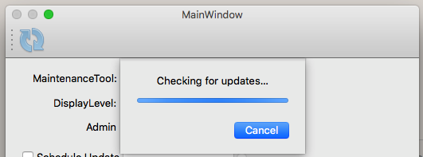
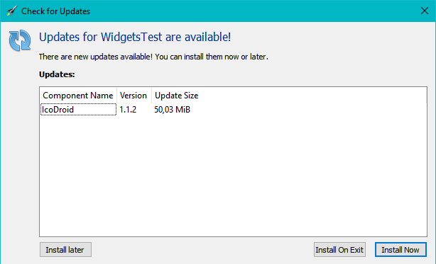
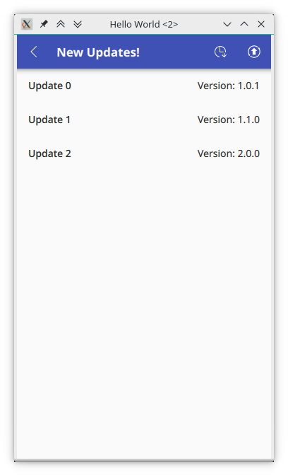
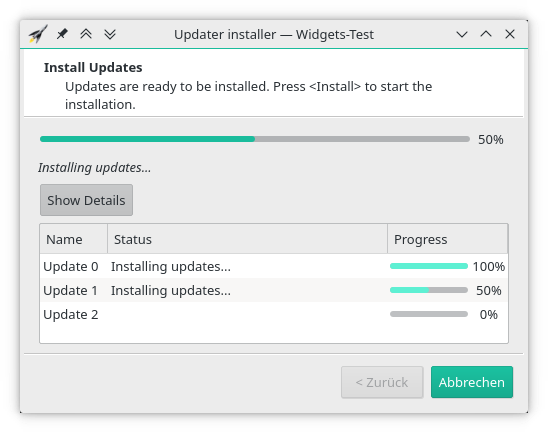
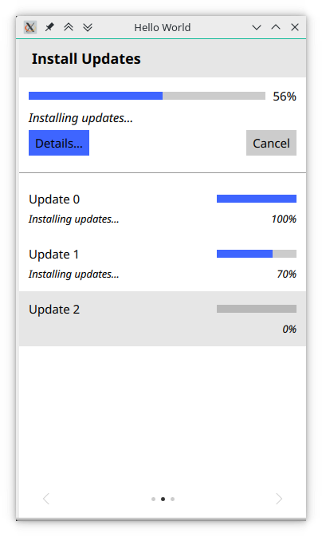

# QtAutoUpdater

The Qt auto updater library is a library to automatically check for updates and install them based on various backends. This repository includes:

 - A library with the basic updater (without any GUI)
 - An automated Widgets GUI
 - An automated Quick GUI

[](https://travis-ci.org/Skycoder42/QtAutoUpdater)
[](https://ci.appveyor.com/project/Skycoder42/qtautoupdater/branch/master)
[](https://www.codacy.com/app/Skycoder42/QtAutoUpdater)

> The library was recently updated to version 3.0. That release differes strongly from 2.1. Use the [Porting Guide](porting_guide.md) to get your application from 2.1 to 3.0!

## Features
### Core Library
- Automatic Check for updates
- Install updates in parallel or after exit
- Simple update scheduling mechanism for the running instance
- Currently 7 different backends are supported:
	- [Qt Installer Framework](https://doc.qt.io/qtinstallerframework/index.html) (For cross platform desktop)
	- [PackageKit](https://www.freedesktop.org/software/PackageKit/) (Works with most linux package managers)
	- [Chocolatey](https://chocolatey.org/) (A package manager for Windows)
	- [Homebrew](https://brew.sh/) (A package manager for macOs)
	- [Google Playstore](https://play.google.com/store) (for Android apps)
	- A custom backend that checks for updates based on a HTTP-request and can download and execute any update tool

### GUI Libraries
- Applies for both, the widgets and the quick GUI
- Automated classes that show dialogs etc. based on a configuration and guide the user through the update process
   - customizable: you can decide what to show
   - extended information dialog or simple dialog to show basic information about the update
- A custom menu action and button for easy integration into the GUI
- *Prepared* for translation and fully translated for:
	- German
	- French
	- Spanish (outdated)
	- Arabic

#### Screenshots
Here some random sample screenshots of the gui (The rocket of the information dialog is the "application icon" and depends on your application). These are various parts of the GUI in various different styles. The first row shows elements from the widgets module, the second from quick

 Element			| Widgets Screenshots								| Quick Screenshots
--------------------|---------------------------------------------------|-------------------
 Progress Dialog	| 		| 
 Information Dialog	| 		| 
 Update Button		| 	| 
 Install Wizard		| 		| 

## Requirements
- The core library only depends on QtCore
- The widgets library only depends on QtWidgets
- The quick library requires Qt Quick Controls 2
- The plugins have different requirements. Typically the package managers and/or libraries associated with that plugin

## Download/Installation
There are multiple ways to install the Qt module, sorted by preference:

1. Package Managers: The library is available via:
	- **Arch-Linux:** AUR-Repository: [`qt5-autoupdater`](https://aur.archlinux.org/packages/qt5-autoupdater/)
	- **MacOs:**
		- Tap: [`brew tap Skycoder42/qt-modules`](https://github.com/Skycoder42/homebrew-qt-modules)
		- Package: `qtautoupdater`
		- **IMPORTANT:** Due to limitations of homebrew, you must run `source /usr/local/opt/qtautoupdater/bashrc.sh` before you can use the module.
2. Simply add my repository to your Qt MaintenanceTool (Image-based How-To here: [Add custom repository](https://github.com/Skycoder42/QtModules/blob/master/README.md#add-my-repositories-to-qt-maintenancetool)):
	1. Start the MaintenanceTool from the commandline using `/path/to/MaintenanceTool --addRepository <url>` with one of the following urls (Alternatively you can add it via the GUI, as stated in the previously linked GUI):
		- On Linux: https://install.skycoder42.de/qtmodules/linux_x64
		- On Windows: https://install.skycoder42.de/qtmodules/windows_x86
		- On Mac: https://install.skycoder42.de/qtmodules/mac_x64
	2. A new entry appears under all supported Qt Versions (e.g. `Qt > Qt 5.13 > Skycoder42 Qt modules`)
	3. You can install either all of my modules, or select the one you need: `Qt Autoupdater`
	4. Continue the setup and thats it! you can now use the module for all of your installed Kits for that Qt
3. Download the compiled modules from the release page. **Note:** You will have to add the correct ones yourself and may need to adjust some paths to fit your installation!
4. Build it yourself! **Note:** This requires perl to be installed. If you don't have/need cmake, you can ignore the related warnings. To automatically build and install to your Qt installation, run:
	- Install and prepare [qdep](https://github.com/Skycoder42/qdep#installation)
	- Install any potential dependencies for the plugins you need
	- Download the sources. Either use `git clone` or download from the releases. If you choose the second option, you have to manually create a folder named `.git` in the projects root directory, otherwise the build will fail.
	- `qmake`
	- `make` (If you want the tests/examples/etc. run `make all`)
	- Optional steps:
		- `make doxygen` to generate the documentation
		- `make -j1 run-tests` to build and run all tests
	- `make install`


## Usage
The autoupdater is provided as a Qt module. Thus, all you have to do is add the module, and then, in your project, add `QT += autoupdatercore` or `QT += autoupdaterwidgets` to your .pro file - depending on what you need! For QML, you can import the library as `de.skycoder42.QtAutoUpdater.Core` and `de.skycoder42.QtAutoUpdater.Quick`.

**Note:** When preparing an application for the release, the `windeployqt` and `macdeployqt` will *not* include the plugins! You have to manually copy matching libraries from `<QT_PLUGIN_DIR>/updaters`. The `d` suffix is used on windows and the `_debug` suffix on macos for the debug version of the plugins.

### Getting started
The following examples assumes you are using the Qt Installer Framework as backend. The usage is similar for all backends, as you only have to adjust the configuration. This document expects you to already know the installation system you are using. If you are new to all of this, I can personally recommend you to use the Qt Installer Framework. It is relatively easy to use and works for Linux, Windows and macOs.

Here are some links that will explain how to create an online-installer using the QtIFW framework. Once you have figured out how to do that, it's only a small step to the updater library:
 - [QtIFW - Tutorial: Creating an Installer](https://doc.qt.io/qtinstallerframework/ifw-tutorial.html): Check this to learn how to create an installer in general. Don't be afraid, it's a very short tutorial
 - [QtIFW - Creating Online Installers](https://doc.qt.io/qtinstallerframework/ifw-online-installers.html): This page will tell you how to create an online installer from your offline installer - in just 2 steps
 - [QtIFW - Promoting Updates](https://doc.qt.io/qtinstallerframework/ifw-updates.html): And this site explains how to create updates

### Examples
Since this library requires the maintenancetool that is deployed with every Qt Installer Framework installation, the examples cannot be tested without a maintenancetool! If you intend to recreate this example, set the path to the `MaintenanceTool` that is deployed with the installation of Qt (or any other maintenancetool). So make shure to adjust the path if you try to run the examples.

#### Updater
The following example shows the basic usage of the updater. Only the core library is required for this example. It creates a new updater instance that is connected to the maintenancetool located at "C:/Qt/MaintenanceTool". As soon as the application starts, it will check for updates and print the update result. If updates are available, their details will be printed and the maintenancetool is scheduled to start on exit. In both cases, the application will quit afterwards.

```cpp
#include <QCoreApplication>
#include <QDebug>
#include <QtAutoUpdaterCore/Updater>

int main(int argc, char *argv[])
{
	QCoreApplication a{argc, argv};
	//create the updater with the application as parent -> will live long enough start the tool on exit
	auto updater = new QtAutoUpdater::Updater::create("qtifw", {
		{"path", "C:/Qt/MaintenanceTool"} //.exe or .app is automatically added on the platform
	}, &a);

	QObject::connect(updater, &QtAutoUpdater::Updater::checkUpdatesDone, [updater](QtAutoUpdater::Updater::State state) {
		qDebug() << "Update result:" << state;
		if (state == QtAutoUpdater::Updater::State::NewUpdates) {
			//As soon as the application quits, the maintenancetool will be started in update mode
			qDebug() << "Update info:" << updater->updateInfo();
			updater->runUpdater();
		}
		//Quit the application
		qApp->quit();
	});

	//start the update check
	updater->checkForUpdates();
	return a.exec();
}
```

#### UpdateController (QtWidgets)
This example will show you the full dialog flow of the update controller, which is used by the widgets library to control the update GUI flow. Since there is no mainwindow in this example, you will only see the controller dialogs. Please note that you can control how much of that dialogset will be shown to the user. This example is *reduced*! for a full example with all parts of the controller, check the `examples/autoupdatergui/WidgetsUpdater` application.

```cpp
#include <QApplication>
#include <QtAutoUpdaterWidgets/UpdateController>

int main(int argc, char *argv[])
{
	QApplication a{argc, argv};
	//Since there is no mainwindow, the various dialogs should not quit the app
	QApplication::setQuitOnLastWindowClosed(false);
	//first create an updater as usual
	auto updater = new QtAutoUpdater::Updater::create(...);
	//then create the update controller with the application as parent -> will live long enough start the tool on exit
	//since there is no parent window, all dialogs will be top-level windows
	auto controller = new QtAutoUpdater::UpdateController{updater, &a};
	//start the update check -> AskLevel to give the user maximum control
	controller->start(QtAutoUpdater::UpdateController::DisplayLevel::Ask);
	return a.exec();
}
```

#### Quick GUI
Unlike the widgets variant, in quick you simply place all the components you want to be shown and attach the to an updater. The flow is created automatically, since all the components know when to show up. It was designed differently, as QML follows a declarative approach. The following shows a basic QML based GUI using simple dialogs. This example is *reduced*! for a full example with all parts of the controller, check the `examples/autoupdaterquick/QuickUpdater` application.

```qml
import de.skycoder42.QtAutoUpdater.Core 3.0
import de.skycoder42.QtAutoUpdater.Quick 3.0

ApplicationWindow {
	visible: true
	width: 360
	height: 600
	title: qsTr("Hello World")

	// Create the updater, just as you would in cpp
	property Updater globalUpdater: QtAutoUpdater.createUpdater(...)

	// the button to start the update check
	UpdateButton {
		anchors.centerIn: parent
		updater: globalUpdater
	}

	// dialog to show the check progress
	ProgressDialog {
		updater: globalUpdater
	}

	// dialog to show the update result
	UpdateResultDialog {
		updater: globalUpdater
		autoRunUpdater: true
	}
}
```

## Documentation
The documentation is available on [github pages](https://skycoder42.github.io/QtAutoUpdater/). It was created using [doxygen](http://www.doxygen.org/). The HTML-documentation and Qt-Help files are shipped together with the module for both the custom repository and the package on the release page. Please note that doxygen docs do not perfectly integrate with QtCreator/QtAssistant.

## Translations
The core library does not need any translation, because it won't show anything to the user. The Gui library however does. The project is prepared for translation. Only a few translations are provided. However, you can easily create the translations yourself. The file `src/translations/qtautoupdater_template.ts` is a ready-made TS file. Just rename it (e.g. to `qtautoupdater_jp.ts`) and open it with the QtLinguist to create the translations.

### Contributed translations:
- French by [@aalex420](https://github.com/aalex420)
- Spanish by [@checor](https://github.com/checor)
- Arabic by [@abdullah-radwan](https://github.com/abdullah-radwan)

## Icon sources/Links
- [FatCow Free Icons](https://www.fatcow.com/free-icons)
- [Icons - Material Design](https://material.io/resources/icons/?style=outline)
- [IconArchive](http://www.iconarchive.com/)
- http://www.ajaxload.info/

### Test Project
 - http://www.oxygen-icons.org/
