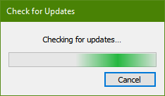
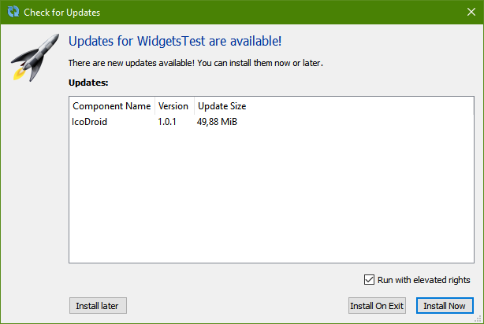
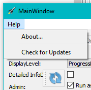
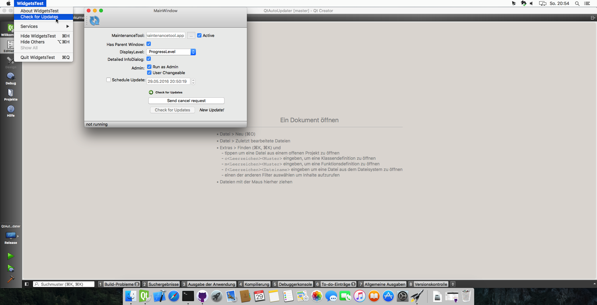
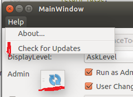

# QtAutoUpdater

The Qt auto updater library is a library to automatically check for updates and install them. This repository includes:
 - A library with the basic updater (without any GUI)
 - A second library that requires the first one and adds basic GUI features

[](https://travis-ci.org/Skycoder42/QtAutoUpdater)
[](https://ci.appveyor.com/project/Skycoder42/qtautoupdater/branch/master)
[](https://www.codacy.com/app/Skycoder42/QtAutoUpdater)

## Features
### Core Library
 - Automatic Check for updates using the maintenancetool
 - Can automatically run the maintenancetool after the application finished
   - To run as admin/root, either use the GUI library or implement it yourself (via an interface)
 - Simple update scheduling mechanism for the running instance

### GUI Library
 - Requires Widgets (no direct QML-support, and I'm not intending to create one. The library can be used for QML applications, since it operates mostly with own windows. If you want to use the updater in QML, do the connection yourself!)
 - Automated controller to guide the user through the check-for-updates process
   - customizable: you can decide what to show
   - extended information dialog or simple dialog to show basic information about the update
 - "Run as Admin/root" fully supported on all 3 platforms
 - UpdateAction -> a QAction that starts the updater
 - UpdateButton -> a button with a busy-indicator to to the same
 - *Prepared* for translation

#### Screenshots
Here some sample screenshots of the gui (The rocket of the information dialog is the "application icon" and depends on your application)

| Dialog Sample      | Windows                                                  | Mac                                                      | X11                                                      |
|--------------------|----------------------------------------------------------|----------------------------------------------------------|----------------------------------------------------------|
| Progress Dialog	 |  |  |  |
| Information Dialog |   |   |   |
| Update Button		 |    |    |    |
| Update Action		 |             |             |             |

## Requirements
 - Qt Installer Framework: The updater requires the application to be installed using the framework and will use the frameworks update mechanism to check for updates (https://doc.qt.io/qtinstallerframework/, download at via Qt MaintenanceTool)
 - Since the Installer Framework supports Windows, Mac and X11 only, it's the same for this library

## Download/Installation
There are multiple ways to install the Qt module, sorted by preference:

1. Simply add my repository to your Qt MaintenanceTool (Image-based How-To here: [Add custom repository](https://github.com/Skycoder42/QtModules/blob/master/README.md#add-my-repositories-to-qt-maintenancetool)):
	1. Open the MaintenanceTool, located in your Qt install directory (e.g. `~/Qt/MaintenanceTool`)
	2. Select `Add or remove components` and click on the `Settings` button
	3. Go to `Repositories`, scroll to the bottom, select `User defined repositories` and press `Add`
	4. In the right column (selected by default), type:
		- On Linux: https://install.skycoder42.de/qtmodules/linux_x64
		- On Windows: https://install.skycoder42.de/qtmodules/windows_x86
		- On Mac: https://install.skycoder42.de/qtmodules/mac_x64
	5. Press `Ok`, make shure `Add or remove components` is still selected, and continue the install (`Next >`)
	6. A new entry appears under all supported Qt Versions (e.g. `Qt > Qt 5.8 > Skycoder42 Qt modules`)
	7. You can install either all of my modules, or select the one you need: `Qt Auto Updater`
	8. Continue the setup and thats it! you can now use the module for all of your installed Kits for that Qt Version
2. Download the compiled modules from the release page. **Note:** You will have to add the correct ones yourself and may need to adjust some paths to fit your installation!
3. Build it yourself! **Note:** This requires perl, [qpmx](https://github.com/Skycoder42/qpmx) and [qpm](https://github.com/Cutehacks/qpm) to be installed. If you don't have/need cmake, you can ignore the related warnings. To automatically build and install to your Qt installation, run:
	- `qmake`
	- `make qmake_all`
	- `make`
	- `make install`

## Usage
The autoupdater is provided as a Qt module. Thus, all you have to do is add the module, and then, in your project, add `QT += autoupdatercore` or `QT += autoupdatergui` to your .pro file - depending on what you need!

### Getting started
The usage of this library is not that complicated. However, to make this work you will have to use the Qt Installer Framework to create an installer/updater. If you already know how to to that, just check out the examples below. If not, here are some links that
will explain how to create an online-installer using the framework. Once you have figured out how to do that, it's only a small step
to the updater library:
 - [QtIFW - Tutorial: Creating an Installer](https://doc.qt.io/qtinstallerframework/ifw-tutorial.html): Check this to learn how to create an installer in general. Don't be afraid, it's a very short tutorial
 - [QtIFW - Creating Online Installers](https://doc.qt.io/qtinstallerframework/ifw-online-installers.html): This page will tell you how to create an online installer from your offline installer - in just 2 steps
 - [QtIFW - Promoting Updates](https://doc.qt.io/qtinstallerframework/ifw-updates.html): And this site explains how to create updates

### Examples
**Important:**<br>
Since this library requires the maintenancetool that is deployed with every Qt Installer Framework installation, the examples cannot be tested without a maintenancetool! If you intend to use this library, the maintenancetool will be available for your final application. For testing purpose or the examples, I set the path to the `MaintenanceTool` that is deployed with the installation of Qt (or any other maintenancetool). So make shure to adjust the path if you try to run the examples.

#### Updater
The following example shows the basic usage of the updater. Only the core library is required for this example. It creates a new updater instance that is connected to the maintenancetool located at "C:/Qt/MaintenanceTool". As soon as the application starts, it will check for updates and print the update result. If updates are available, their details will be printed and the maintenancetool is scheduled to start on exit. In both cases, the application will quit afterwards.

```cpp
#include <QCoreApplication>
#include <QDebug>
#include <updater.h>

int main(int argc, char *argv[])
{
	QCoreApplication a(argc, argv);
	//create the updater with the application as parent -> will live long enough start the tool on exit
	QtAutoUpdater::Updater *updater = new QtAutoUpdater::Updater("C:/Qt/MaintenanceTool", &a);//.exe is automatically added

	QObject::connect(updater, &QtAutoUpdater::Updater::checkUpdatesDone, [updater](bool hasUpdate, bool hasError) {
		qDebug() << "Has updates:" << hasUpdate << "\nHas errors:" << hasError;
		if(hasUpdate) {
			//As soon as the application quits, the maintenancetool will be started in update mode
			updater->runUpdaterOnExit();
			qDebug() << "Update info:" << updater->updateInfo();
		}
		//Quit the application
		qApp->quit();
	});

	//start the update check
	updater->checkForUpdates();
	return a.exec();
}
```

#### UpdateController
This example will show you the full dialog flow of the controller. Both libraries are required for this example. Since there is no mainwindow in this example, you will only see the controller dialogs. Please note that you can control how much of that dialogset will be shown to the user. This example is *reduced*! for a full example with all parts of the controller, check the `examples/autoupdatergui/WidgetsUpdater` application.

```cpp
#include <QApplication>
#include <updatecontroller.h>

int main(int argc, char *argv[])
{
	QApplication a(argc, argv);
	//Since there is no mainwindow, the various dialogs should not quit the app
	QApplication::setQuitOnLastWindowClosed(false);
	//create the update controller with the application as parent -> will live long enough start the tool on exit
	//since there is no parent window, all dialogs will be top-level windows
	QtAutoUpdater::UpdateController *controller = new QtAutoUpdater::UpdateController("C:/Qt/MaintenanceTool", &a);//.exe is automatically added

	QObject::connect(updater, &QtAutoUpdater::UpdateController::runningChanged, [updater](bool running) {
		qDebug() << "Running changed:" << running;
		//quit the application as soon as the updating finished
		if(!running)
			qApp->quit();
	});

	//start the update check -> AskLevel to give the user maximum control
	controller->start(QtAutoUpdater::UpdateController::AskLevel);
	return a.exec();
}
```

## Documentation
The documentation is available on [github pages](https://skycoder42.github.io/QtAutoUpdater/). It was created using [doxygen](http://www.doxygen.org/). The HTML-documentation and Qt-Help files are shipped
together with the module for both the custom repository and the package on the release page. Please note that doxygen docs do not perfectly integrate with QtCreator/QtAssistant.

## Translations
The core library does not need any translation, because it won't show anything to the user. The Gui library however does. The project is prepared for translation. Only german and spanish translations are provided. However, you can easily create the translations yourself. The file `src/autoupdatergui/translations/QtAutoUpdaterController_template.ts` is a ready-made TS file. Just rename it (e.g. to `QtAutoUpdaterController_jp.ts`) and open it with the QtLinguist to create the translations.

## Icon sources/Links
Most icons have been found using [IconArchive](http://www.iconarchive.com/)

### GUI Library
 - http://www.fatcow.com/free-icons
 - http://www.ajaxload.info/

### Test Project
 - http://www.oxygen-icons.org/
